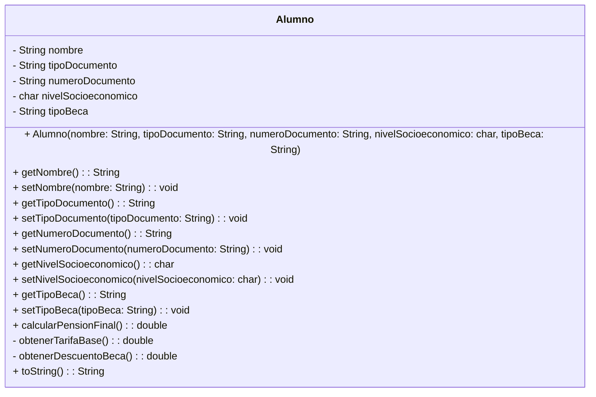

# Documentación del Caso: Instituto Innova

## 1. Diagrama de Ishikawa (Causa-Efecto)

**Problema Principal / Efecto (Cabeza):** Gestión deficiente de la información de alumnos y pensiones.

**Causas (Espinas):**

*   **Identificación (Arriba 1):**
    *   Falta validar dígitos exactos por tipo de documento.
    *   Falta identificar si es DNI o Residencia Temporal.
*   **Nombre Completo (Arriba 2):**
    *   Problemas de homonimia no controlados.
    *   Falta distinguir alumnos que tienen el mismo nombre.
*   **Categorización (Arriba 3):**
    *   Error al categorizar el porcentaje de beca (0%, 50%, 100%).
    *   Cálculo erróneo de la pensión final por nivel (A, B, C).
*   **Gestión Manual (Abajo 1):**
    *   Registro y cálculos hechos a mano.
    *   Supervisión dependiente de una sola persona (Regina).
*   **Volumen / Contacto (Abajo 2):**
    *   Más de 500 alumnos que administrar al día.
*   **Tecnología Utilizada (Abajo 3):**
    *   Múltiples hojas de cálculo (Excel) dispersas.
    *   Carpetas físicas ocupando espacio en la oficina.
    *   Falta de manejo centralizado (software).

---

## 2. Identificación de Restricciones

A partir del caso, se han identificado las siguientes restricciones críticas para el desarrollo del proyecto:

1.  **Presupuesto muy bajo:** No se puede invertir en hardware nuevo y costoso.
2.  **Hardware limitado:** El sistema debe ejecutarse obligatoriamente en las computadoras actuales de los laboratorios del instituto. Por ende, el software debe ser sumamente ligero.
3.  **Lenguaje de programación:** El sistema debe ser desarrollado obligatoriamente en Java.
4.  **Recursos Humanos (Equipo de desarrollo):** Solo hay 2 personas para desarrollar el software (Juan y Regina).

---

## 3. Alternativas de Solución y Mejor Opción

**Alternativa A: Sistema Web en la Nube con Base de Datos Relacional**
*   *Pro:* Centralización total y acceso desde cualquier lugar.
*   *Contra:* Requiere pago de servidores, mayor tiempo de desarrollo e inversión económica (viola la restricción 1 y 2).

**Alternativa B: Aplicación Ligera de Consola / Escritorio en Java (POO)**
*   *Pro:* Se ejecuta localmente consumiendo muy pocos recursos (cumple restricción de hardware). Al usar Java y POO, se pueden programar las validaciones estrictas y encapsular la lógica sin requerir un equipo de desarrollo grande. No genera costos extra.
*   *Contra:* Interfaz menos gráfica, pero 100% funcional y rápida de implementar.

**Mejor opción elegida:** La **Alternativa B**. Un sistema ligero implementado en Java utilizando el paradigma de Programación Orientada a Objetos. Cumple con el bajo presupuesto, utiliza el hardware existente y permite resolver el problema de integridad de datos mediante el encapsulamiento y validaciones.

---

## 4. Diseño UML de la Clase (Estándar)

