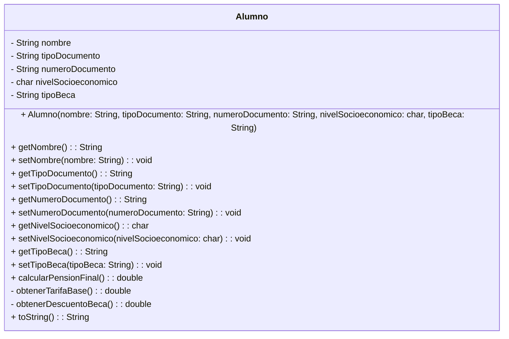

# Documentación del Caso: Instituto Innova

## 1. Diagrama de Ishikawa (Causa-Efecto)

**Problema Principal:** Caos en la gestión de la información, falta de integridad de datos y errores en el cálculo de pensiones.

*   **Personas (Mano de Obra):**
    *   Una sola administradora (Regina) supervisando todo.
    *   Alumnos con nombres homónimos (mismo nombre), difíciles de distinguir.
*   **Métodos (Procesos):**
    *   Asignación de tarifas y becas de forma manual.
    *   Falta de un proceso de validación automática para documentos de identidad.
*   **Máquinas (Herramientas / Sistema):**
    *   Uso de múltiples archivos Excel desconectados y carpetas físicas.
    *   Ausencia de un software centralizado con reglas de validación.
*   **Entorno:**
    *   Crecimiento de la comunidad (más de 500 alumnos) que hace insostenible el manejo manual.
*   **Políticas / Reglas:**
    *   Reglas estrictas de becas (Parcial 50%, Total 100%) y niveles socioeconómicos (A, B, C) que actualmente se calculan manualmente, propiciando errores.

---

## 2. Identificación de Restricciones

A partir del caso, se han identificado las siguientes restricciones críticas para el desarrollo del proyecto:

1.  **Presupuesto muy bajo:** No se puede invertir en hardware nuevo y costoso.
2.  **Hardware limitado:** El sistema debe ejecutarse obligatoriamente en las computadoras actuales de los laboratorios del instituto. Por ende, el software debe ser sumamente ligero.
3.  **Lenguaje de programación:** El sistema debe ser desarrollado obligatoriamente en Java.
4.  **Recursos Humanos (Equipo de desarrollo):** Solo hay 2 personas para desarrollar el software (Juan y Regina).

---

## 3. Alternativas de Solución y Mejor Opción

**Alternativa A: Sistema Web en la Nube con Base de Datos Relacional**
*   *Pro:* Centralización total y acceso desde cualquier lugar.
*   *Contra:* Requiere pago de servidores, mayor tiempo de desarrollo e inversión económica (viola la restricción 1 y 2).

**Alternativa B: Aplicación Ligera de Consola / Escritorio en Java (POO)**
*   *Pro:* Se ejecuta localmente consumiendo muy pocos recursos (cumple restricción de hardware). Al usar Java y POO, se pueden programar las validaciones estrictas y encapsular la lógica sin requerir un equipo de desarrollo grande. No genera costos extra.
*   *Contra:* Interfaz menos gráfica, pero 100% funcional y rápida de implementar.

**Mejor opción elegida:** La **Alternativa B**. Un sistema ligero implementado en Java utilizando el paradigma de Programación Orientada a Objetos. Cumple con el bajo presupuesto, utiliza el hardware existente y permite resolver el problema de integridad de datos mediante el encapsulamiento y validaciones.

---

## 4. Diseño UML de la Clase (Estándar)

